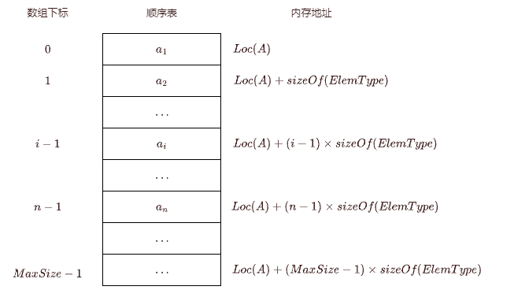

# 顺序存储

> 线性表顺序存储又称之为顺序表，是一组地址连续的存储单元按顺序依次存储线性表中的数据元素，从而使逻辑上相邻的两个元素在物理位置上也相邻。

第 $1$ 个元素在线性表的起始位置，而第 $i$ 个元素在物理存储空间上后面紧跟着的是第 $i+1$ 个元素；

**顺序表** 中元素的逻辑顺序和其物理顺序是相同的。

以下是示意图：

> [!TIP] 提示
>
> - 每个数据元素存储位置和起始位置所差的存储单元数量应该等于 $(n - 1) \times sizeof(ElemType)$ 。
> - 每个数据元素均可以随机存取（即随意直接取出任意序列的数据元素）。
> - 线性表序列从 $1$ 开始，而高级语言中的数据序列是从 $0$ 开始的。

## 代码表示

线性表元素类型为 `ElemType`，则线性表的顺序存储类型描述为：

<<< ./sequenceStorage/code.c#define

> [!TIP] 提示
>
> - 用于存储元素的数组可以是静态分配的，也可以是动态分配的(本文未提及)，静态分配需要预分配大小，而动态分配是在运行时通过内存分配语句来实现内存的申请和销毁的（C 中的 `malloc`）。
> - 顺序表最重要的特点是随机访问，通过首地址和元素的序号就可以在时间 $O(1)$ 找到元素。
> - 存储密度高；节点只用于存储数据；逻辑上相邻的元素物理上也是相邻的，这导致插入和删除元素需要移动很多元素。

## 初始化线性表

构造一个空的线性表，通过传入一个指针后再执行 `malloc` 来进行初始化。

<<< ./sequenceStorage/code.c#InitList

## 销毁线性表

通过使用 `free` 来销毁线性表：

<<< ./sequenceStorage/code.c#DestroyList

## 判断表是否为空

如果为空，返回 $0$，不然返回 $1$：

<<< ./sequenceStorage/code.c#ListEmpty

## 线性表长度

获取线性表的长度，实际上只要返回成员 $length$ 的值就可以：

<<< ./sequenceStorage/code.c#ListLength

## 输出线性表

当线性表不为空时，顺序显示表中的所有元素：

<<< ./sequenceStorage/code.c#DispList

## 获取某个数据元素的值

从头逐个遍历整个线性表，如果找到返回 $1$，否则返回 $0$：

<<< ./sequenceStorage/code.c#GetElem

## 按元素值查找位置

在线性表中查找第一个与 $e$ 相等的元素，返回其位置，否则返回 $0$ ：

<<< ./sequenceStorage/code.c#LocateElem

> [!NOTE] 时间复杂度
> 最好情况：元素在表头，时间复杂度为 $O(1)$。
>
> 最坏情况：元素在表尾，需要比较 $n$ 次，时间复杂度为 $O(n)$。
>
> 平均情况：TODO

## 插入操作

在顺序表 $L$ 的第 $i$ 个位置插入新元素 $e$。

若 $i$ 的输入不合法，则返回 $0$，表示插入失败；否则将第 $i$ 个元素以及其后面所有元素依次向后移动一个位置，在空出的位置插入新的元素 $e$，顺序表长度增加 $1$，插入成功，返回 $1$。

<<< ./sequenceStorage/code.c#ListInsert

> [!NOTE] 时间复杂度
> 最好情况：在表尾插入，则无需将元素后移，直接插入即可，时间复杂度为 $O(1)$。
>
> 最坏情况：在表头插入，则需将所有元素均后移一位，再进行插入，时间复杂度为 $O(n)$。
>
> 平均情况：TODO

## 删除操作

删除顺序表 $L$ 的第 $i$ 个位置元素。

若 $i$ 的输入不合法，则返回 $0$，表示删除失败；否则将第 $i$ 个元素以及其后面所有元素依次向前移动一个位置，并获取被删除元素 $e$，顺序表长度减少 $1$，删除成功，返回 $1$。

<<< ./sequenceStorage/code.c#ListInsert

> [!NOTE] 时间复杂度
> 最好情况：在表尾删除，则无需将元素前移，直接删除即可，时间复杂度为 $O(1)$。
>
> 最坏情况：在表头删除，则需将所有元素均前移一位，再进行删除，时间复杂度为 $O(n)$。
>
> 平均情况：TODO

## 合并顺序表

对于有序的两个表 $L_{a}$ 和 $L_{b}$ 合并，只需要同时便利并比较两个表进行合并即可：

<<< ./sequenceStorage/code.c#ListMerge

> [!NOTE] 时间复杂度
> 由于需要完整遍历两个链表，故时间复杂度为 $O(L_{a}.length + L_{b}.length - 1)$。
